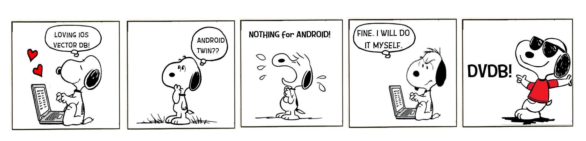

# Mobile-First DVDB (Dart Vector DB): The Pocket-Sized Powerhouse for Your Apps! 🚀



This DVDB repository provides functionality to create a vector database locally on a mobile device. 

## Why did we create this?
We at [Fast Code AI](https://fastcode.ai/) were working on a use case that required us to create privacy-preserving, on-device vector databases, ensuring that private user information never left their devices. So, we started searching for suitable on-device vector databases on the internet. We found [SVDB](https://github.com/Dripfarm/SVDB), which provides on-device vector database support for iOS-based applications, and it worked well for our iOS application. However, we also needed one for Android. Alas, to the best of our knowledge, no such vector database existed for Android.


## Our solution
One way to address this issue was to write a local vector database for Android similar to SVDB, but the main challenge in this scenario would be managing two different vector databases for both applications. Therefore, we considered writing a unified vector database that would work on both Android and iOS-based applications. In this repository, we have created a Dart-based vector db that can be used in Flutter-based applications.

We have benchmarked the performance of our DVDB against SVDB on the iPhone 14. Additionally, we also have the same benchmarks on an Android device (Vivo 2252 Y02T) to demonstrate that it works on both devices, inlcuding low end devices.


## DVDB Highlights ✨
- **Privacy First**: Private user data never leaves their device, and do not reside on our services. You own your data and your embeddings.   
- **No Server, No Cry**: DVDB runs locally on device. Thus, zero latency and no hassle of server upkeep!
- **OpenAI's Embeddings Support**: Add OpenAI Embeddings in DVDB in few lines of code.
- **Custom Embeddings**: Create your own embeddings and add it in DVDB instead of OpenAI embeddings.
- **Multi-platform Support**: Whether you're team Android or squad iOS, DVDB works on both, making app development a breezy affair.


## Launch Your Journey with DVDB 🚀

### Install Flutter

- **Step 1**: Install the Flutter SDK from the [official website](https://flutter.dev/docs/get-started/install).
- **Step 2**: Set up your development environment with your favorite IDE, and install the Dart plugin.
- **Step 3**: Run `flutter doctor` in your terminal to ensure everything is set up properly.

### Install our DVDB

- **Step 4**: Run `git clone https://github.com/FastCodeAI/DVDB.git` 


## DVDB Quick Launch: Magic in Minutes! 🎩✨

After you've set up your codebase, it's time to start using DVDB! Check out the `vector_db_example.dart` in examples folder to see DVDB in action. Simply run the script from the command line as mentioned below:

```bash
dart example/vector_db_example.dart
```

Want to use DVDB in your Flutter project? Just add the below command into your pubspec.yaml and start using it:

```
DVDB:
    path: ./path_to_dvdb_folder/DVDB/
```


## Explore More About DVDB 🔍

### Benchmakring Results:

The following table shows the benchmarking results on SVDB as compared to DVDB on iPhone 14.
##### Note: The time is in miliseconds.

#### Insertion over n documents

| # vectors in DB |  SVDB  | DVDB |
| --------------- | ------ | --------- |
|       100		  | 9801.3 | 15.9 |
|       500       | 277903.0 | 45.36 |

#### Searching

| # vectors in DB |    SVDB   |  DVDB |
| --------------- | --------- | --------- |
|       100		  | 34.9418 | 15.9485 |
|       500       | 93.7644 | 33.3472 |


The following table shows the benchmarking results of DVDB on android phone.

#### Insertion over n documents

| # vectors in DB | DVDB |
| --------------- | -------- |
|       100		  | 264.379 |
|       500       | 891.433 |

#### Searching

| # vectors in DB | DVDB |
| --------------- | -------- |
|       100		  | 67.309 |
|       500       | 155.228 |


